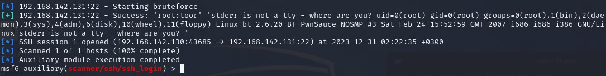

# PZ6_Lr3
Выполнил Панков Никита, ББМО-01-23

# C помощью ifconfig узнаем ip-адрес DVL. Cканируем ip-адрес с помощью nmap

# Сканируем DVL при помощи Openvas

# XSS

1) Запускаем burpsuite. Переходим во вкладуку Proxy и включаем перехват.
2) Переходим на сайт с XSS уязвимостью

3) После ввода данных и нажатия кнопки Add Comment в burpsuite увидим запрос
4) меняем последнюю строчку на name=Pankov&comment=<script>alert ("Pankov_XSS") </script >

 
# CSRF

1) Переходим на сайт с CSRF уязвимостью

3) После ввода данных и нажатия кнопки Add Comment в burpsuite увидим запрос
4) Меняем последнюю строчку на item=pen&quantity=1234567890

# Устанавливаем и запускаем OWASP ZAP. Запускаем автоматическое сканирование и исследуем результат SQL injection

# Запускаем metasploit. Настраиваем RHOST, USERNAME, PASS_FILE, STOP_ON_SUCCESS. Запускаем

# Подключаемся к SSH. Заходим в mysql. Находим файл с логином и паролем в зашифрованном виде. Создаем txt файл в который вписываем зашифрованный пароль. Запускаем JohnTheRipper и ищем пароль 

# Анализ трафика с помощью wireshark

# Snort правила

